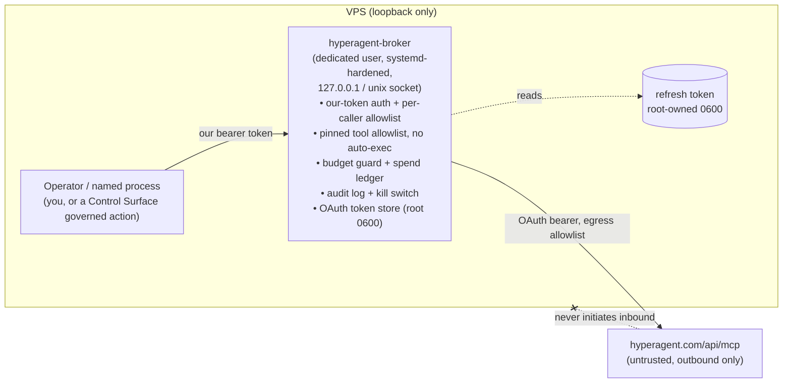

# Hyperagent MCP integration — isolated agent-tool broker (PLAN-ONLY)

Status: **PLAN-ONLY. Nothing implemented. No credential created, stored, or used.**
Author: Claude (Opus 4.8), 2026-07-19 UTC
Decision (operator, 2026-07-19): **Gate hyperagent's agents as a tool** behind an isolated,
operator-only broker. **Not** a LiteLLM model-rotation integration (hyperagent exposes no models).

Convention sibling: `OMNIROUTE_INTEGRATION_PLAN.md` (same "credential-isolated, shareable-safe leaf,
plan-only until approved" discipline).

---

## 1. What hyperagent actually is (verified recon, no auth used)

- **An AI agent platform, not an inference provider.** Public site: *"Agents that ship real, powerful
  work"* — produces sites/decks/docs/dashboards; each agent backed by *"a persistent virtual machine,
  real-time code execution, a dedicated browser, and Exa-fueled web intelligence"*; triggers via
  Slack/Telegram/email/webhooks/timers. Pricing is **per-task** (~$6–25/run). No `/v1/chat/completions`,
  no `base_url`, no named models. → The $500 is **task-run credit**, not token credit.
- **MCP endpoint** `https://hyperagent.com/api/mcp`: `HTTP 405 allow: POST`, `content-type:
  application/json`, `noindex` → MCP **Streamable HTTP** (JSON-RPC over a single POST).
- **Auth = OAuth 2.1 protected resource (RFC 9728), no static API key.** Unauthenticated `initialize`
  returned `401` with:
  `www-authenticate: Bearer resource_metadata=".../.well-known/oauth-protected-resource",
  scope="threads:read threads:write approvals:read approvals:write"`.
- **Authorization-server metadata** (`/.well-known/oauth-authorization-server`):
  - issuer `https://hyperagent.com`
  - authorize `https://hyperagent.com/api/oauth/authorize`
  - token `https://hyperagent.com/api/oauth/token`
  - register `https://hyperagent.com/api/oauth/register` (**dynamic client registration**)
  - grants `authorization_code`, `refresh_token`; PKCE `S256`; `token_endpoint_auth_methods: none`
    (**public client** — security rests on PKCE + refresh-token secrecy)
  - scopes `threads:read threads:write approvals:read approvals:write offline_access`
  - bearer via `header`
- **Capability surface** = **threads** (start/read agent tasks) + **approvals** (approve agent
  actions). `approvals:write` is security-relevant: a token-holder can *approve* agent actions.

Implication: getting access is an **interactive, operator-in-the-loop OAuth consent**, not pasting a
key. The durable secret is a **refresh token** (`offline_access`).

---

## 2. Threat model (why a direct wire is unacceptable on this box)

This VPS runs live products and holds LiteLLM keys, the M365 secret, GPU SSH keys, and grants agents
broad file/command access. Risks of wiring an untrusted external agent MCP directly:

1. **Prompt injection / tool poisoning** — MCP *tool descriptions* and *thread outputs* are
   attacker-controllable text. If they enter an auto-executing agent here, they can drive commands/edits.
2. **Data exfiltration** — every tool arg is sent to hyperagent (which runs its own VM + browser).
   Handing it repo contents, secrets, or PII loses control of them.
3. **Spend abuse** — each `threads:write` (task) costs real money; an injected/looping caller can burn
   the $500 (and beyond) fast.
4. **Approval hijack** — `approvals:write` lets a caller rubber-stamp agent actions; combined with (1)
   that's an amplifier.
5. **Credential blast radius** — a leaked refresh token = standing access to the account.
6. **Inbound reach / supply chain** — the MCP client transport parses attacker-influenced responses;
   the process must not be a pivot into the box.

---

## 3. General policy — "External Provider Isolation" trust tier (reusable)

Generalizes the OmniRoute leaf. Any untrusted external model/agent/MCP provider is onboarded as a
**gated, credential-isolated, outbound-only leaf** — never a direct wire:

- **G1 Single choke point.** Nothing on the box talks to the provider directly. One broker fronts it;
  callers authenticate to *our* broker.
- **G2 Least privilege scopes.** Request the minimum OAuth scopes; withhold dangerous ones by default.
- **G3 Credential isolation + rotation.** Provider secret in a dedicated root-owned `0600` store,
  never co-located with our other secrets; one-command revoke/rotate.
- **G4 Hard budget ceiling.** Spend cap + alerting + auto-disable; every spend action is explicit.
- **G5 Data minimization.** Only synthetic/public inputs leave the box; no secrets/PII/proprietary
  data in arguments; outbound DLP scan.
- **G6 Untrusted-by-default responses.** All provider text (tool descriptions, results) is data, never
  instructions; **no auto-execution** into privileged agents; per-call approval for writes/spend.
- **G7 Outbound-only, sandboxed.** No inbound reach; broker runs as an unprivileged, systemd-hardened
  user with egress allowlisted to the provider host only; bound to loopback/unix-socket.
- **G8 Operator + named-process access only.** Broker requires our own token; per-caller allowlist;
  full audit; no public route.
- **G9 Verify before trust; quarantine on anomaly.** Probe real capability cheaply first; monitor
  spend/latency/error; auto-disable on drift.

---

## 4. Target architecture — the gated broker

- **Broker**: a small dedicated service (Bun/TS, consistent with the stack). Speaks MCP Streamable
  HTTP *to* hyperagent; exposes a **narrow, pinned tool allowlist** *to* our callers. Every call is
  authenticated to us, logged, budget-checked, and — for `threads:write`/spend — operator-confirmed.
- **Scope minimization (G2)**: request `threads:read threads:write offline_access`. **Withhold
  `approvals:write`** (and `approvals:read` unless a concrete need appears) so agent-action approval
  stays a human/operator step, not an automatable one.
- **No raw MCP in any auto-executing agent.** My Claude Code session / OpenClaw / Control Surface only
  ever reach hyperagent *through* the broker, and provider responses never auto-drive box actions.
- **Access control (G8)**: broker binds `127.0.0.1`/unix-socket, requires our own token, per-caller
  allowlist, routed through the Control Surface governed-action + audit path as the "explicit process"
  gate. No Caddy/Cloudflare route — never publicly reachable.

---

## 5. Phased rollout (each phase approval-gated; PLAN-ONLY today)

- **D0 — recon (DONE).** Identified product, transport, OAuth model, scopes, spend model. No creds.
- **D1 — operator go / parameters.** Operator confirms: (a) consent to an interactive OAuth
  authorization (login + approve the client on hyperagent), (b) budget ceiling + alert threshold for
  the $500, (c) first allowed caller, (d) scope set (recommend withholding `approvals:write`).
- **D2 — broker skeleton, no provider creds.** Build the loopback broker: our-token auth, per-caller
  allowlist, audit log, budget ledger, kill switch, systemd hardening (`DynamicUser`/dedicated user,
  `NoNewPrivileges`, `ProtectSystem=strict`, `PrivateTmp`, `ProtectHome`, `RestrictAddressFamilies`,
  egress allowlist to hyperagent.com). Verify locally with a stubbed upstream. Nothing talks to
  hyperagent yet.
- **D3 — one-time OAuth (operator in loop).** Dynamic-client-register + authorization-code+PKCE once;
  store the **refresh token** root-owned `0600`, isolated from all other secrets. Verify a **cheap
  `threads:read`** round-trip. No task spend yet.
- **D4 — pinned tools to ONE caller.** Expose the minimal tool allowlist to a single named caller with
  **per-task confirm + hard budget guard**; run one real low-cost task end-to-end; confirm spend
  ledger + audit + kill switch. Data minimization enforced (synthetic/public inputs only).
- **D5 — optional wider wiring.** Only after D4 proves out: expose the broker as an MCP server to my
  session or a Control Surface action — still through the broker, still gated, still no auto-exec.

Each phase: verify with evidence, log to the vault, never print the refresh/access token.

---

## 6. Operational safety mechanisms

- **Budget**: hard credit ceiling in the broker; block at cap; alert at threshold; spend ledger per task.
- **Kill switch**: `systemctl stop hyperagent-broker` + token revoke → integration dead in one step.
- **Rotation**: refresh-token rotation runbook; revoke on any suspicion.
- **Audit**: every call (caller, tool, args-hash, cost, result-status) recorded; no secret values.
- **Anomaly quarantine**: auto-disable on spend spike, error burst, or unexpected tool set.

---

## 7. D1 decisions — RESOLVED (operator, 2026-07-19)

1. **OAuth consent**: **approved** — a one-time interactive OAuth authorization may be driven.
2. **Budget**: **hard cap $400** (of the $500). Alert at 75% ($300); auto-disable at $400.
3. **Callers**: **all three authorized** — Control Surface governed action, an operator CLI, and the
   Claude Code session. Safety sequencing: D4 still onboards **one** caller for the first real task,
   then expands to all three once the spend ledger + kill switch are proven.
4. **Scopes**: withholding `approvals:write` stands as the default (not contradicted).
5. **First task**: **build a spin-off Know app**, judged on build quality and how well it **integrates
   with other solutions**. Good fit — self-contained, synthetic/public inputs, no secrets/PII needed,
   and a clean way to benchmark hyperagent's output vs. our own build agents.

Status: D1 satisfied. Next actionable phase is **D2 (broker skeleton, no provider creds)**, then D3
(one-time OAuth + refresh-token storage), then D4 (first real task = the Know spin-off, one caller,
budget-guarded). Each remains an explicit build step.

## 8. Explicitly NOT done / NOT authorized yet

- No OAuth client registered, no authorization performed, no token obtained/stored.
- No MCP added to any config (`.mcp.json`, LiteLLM, Control Surface, OpenClaw).
- No task run, no spend, no data sent to hyperagent beyond the unauthenticated protocol probes above.
- No public route, no service created.
